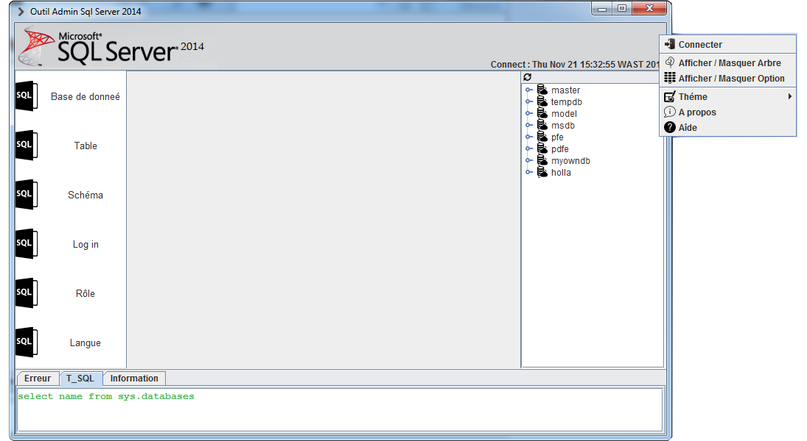

# Administration Tool
Java app that can apply sql query behind the User Interface,
basically is's to manager database :
* DB [ create, delete, modify]
* Table [ create, delete, modify]
* Role [ create, delete, modify]
* Lang [ import, delete]

Prerequisite
------------
* jdk 1.7
* SQL Server 2008
* external lib `miglayout15-swing`

Screenshot
----------

Enjoy.
